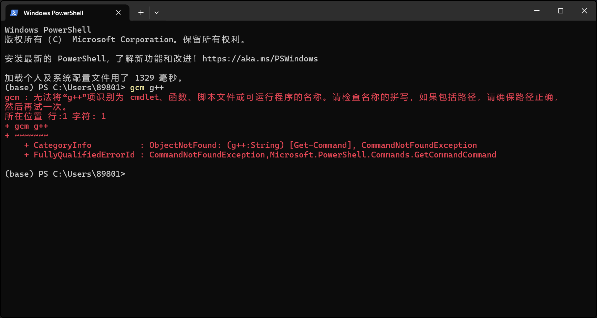
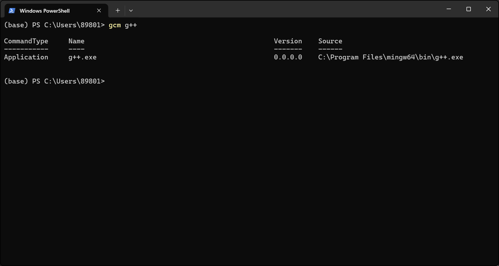
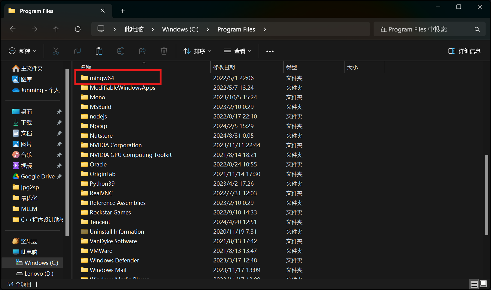
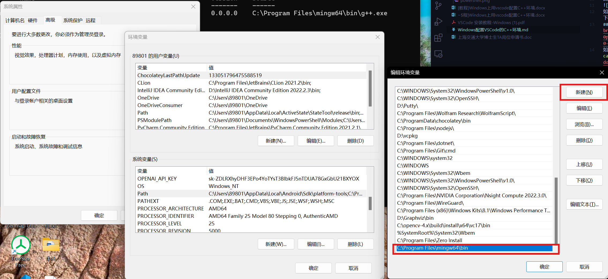
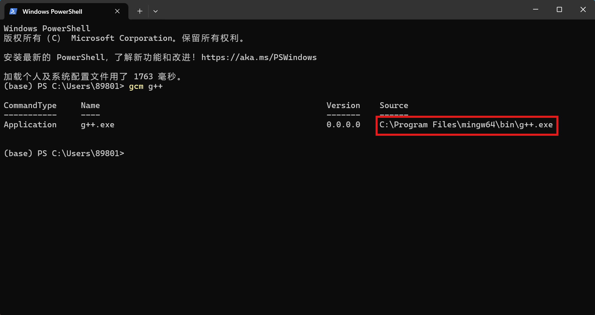

<head>
    <style>
        :root {
            --primary-color: #00ff9d;
            --warning-bg: #2d1a1a;
        }
        body {
            font-family: system-ui, -apple-system, sans-serif;
            max-width: 1200px;
            margin: 0 auto;
            padding: 20px;
            background-color: #f5f5f5;
        }
        h1 {
            text-align: center;
            margin: 2rem 0;
            font-size: 2.5em;
        }
        h2 {
            color: var(--primary-color);
            padding-bottom: 0.5rem;
            padding-top: 0.5rem;
            border-bottom: 2px solid currentColor;
            border-top: 2px solid currentColor;
            margin-top: 2.5em;
        }
        p {
            font-weight: 300;
            font-size: 1.1em;
            line-height: 1.6;
            margin: 20px 0 60px;
            color: #333;
            padding: 10px;
        }
        img {
            max-width: 100%;
            height: auto;
            display: block;
            margin: 1.5em auto;
            border-radius: 8px;
            box-shadow: 0 4px 6px rgba(0, 0, 0, 0.1);
        }
        pre {
            padding: 1.2rem;
            border-left: 3px solid var(--primary-color);
            overflow-x: auto;
            background: #1e1e1e;
            color: #fff;
            border-radius: 0 6px 6px 0;
            tab-size: 4;
        }
        .warning {
            color: #ff5555;
            background: var(--warning-bg);
            padding: 1.2rem;
            border-radius: 8px;
            margin: 1.5rem 0;
            border-left: 4px solid #ff5555;
        }
        .terminal {
            font-family: Consolas, Monaco, monospace;
            background: #000;
            color: var(--primary-color);
            padding: 1.2rem;
            border-radius: 8px;
            white-space: pre-wrap;
        }
        .banner {
            width: 100%;
            height: auto;
            margin: 2em 0;
        }
        a {
            color: var(--primary-color);
            text-decoration: none;
            transition: opacity 0.2s;
        }
        a:hover {
            opacity: 0.8;
        }
        ol {
            counter-reset: step;
            margin-left: 1.5em;
        }
        ol li {
            counter-increment: step;
            margin: 1.2em 0;
            line-height: 1.7;
        }
        ol li::marker {
            color: var(--primary-color);
            font-weight: bold;
        }
        code {
            font-family: Menlo, Consolas, monospace;
            background: rgba(0, 0, 0, 0.08);
            padding: 2px 6px;
            border-radius: 4px;
        }
    </style>
</head>

# 🚀 Windows系统VSCode C/C++开发环境配置指南


## 🔍 环境预检

### 1. 安装VSCode
访问[VSCode官网](https://code.visualstudio.com/)下载安装最新版本。

### 2. 检测编译套件
```powershell
# 通过Windows下方搜索栏搜索Power shell，打开PowerShell执行
gcm g++
```

✅ **预期结果**：  
若报错则继续下一步  
  
若发现已安装，请记录`Source`路径（如图示）并跳至第7步  



## ⚙️ 编译套件部署

### 3. 获取MinGW套件
可以直接[官方下载](https://github.com/.../winlibs-x86_64-...r3.zip)。  
如果官方下载很慢，可以用[校内镜像](https://oc.sjtu.edu.cn/.../download?download_frd=1)。

### 4. 解压安装
```
压缩包解压之后，把里面的mingw64文件夹移动到一个你喜欢的地方，并记住它的路径，备用。
推荐路径：`C:\Program Files\mingw64`
```

<div class="warning">
📌 重要提示：路径禁止包含中文/空格！
</div>




## 🌐 系统环境配置

### 5. 添加PATH变量
1. Windows下方搜索栏搜索"环境变量" → 选择"编辑系统环境变量"。
2. "环境变量..." → 下方的“系统变量（S）”栏 → 下拉，找到并双击“Path”。
3. 点击新建，添加bin路径：`<刚才mingw64的路径>\bin`。

<div class="warning">
📌 上面尖括号中的内容替换成你刚才mingw64的路径，不要原样粘贴。比如刚才我的路径是`C:\Program Files\mingw64`，这里我就填入`C:\Program Files\mingw64\bin`。
</div>



### 6. 验证安装
```powershell
# 新开PowerShell窗口执行
gcm g++
```

<div class="warning">
📌 注意这一步要重新打开一个新的PowerShell，刚改的环境变量在老窗口里没生效。
</div>

✅ 成功标志：显示`g++.exe`路径  



## 🔧 VSCode配置

### 7. 工作区设置
```
1. 创建纯英文路径文件夹（如 D:\CPP_Project）。
2. 在VSCode中打开该文件夹(窗口左上角File->Open Folder...->选择你的文件夹)。
3. 新建example.cpp文件(Folders边栏的右上角新建图标，或者在边栏区域右键->New File...)。
```

### 8. 编写测试代码
```cpp
// example.cpp
#include<iostream>
using namespace std;

int main() {
    cout << "Hello World!" << endl;
    return 0;
}
```

### 9. 配置智能感知
```
1. Ctrl+Shift+P → 输入`C/C++: Edit Configurations (UI)`->回车。
2. 设置Compiler Path为刚才bin目录下的的g++路径。
3. IntelliSense Mode选择`windows-gcc-x64`。
```


## 🚦 运行验证

### 10. 执行测试程序
```
点击右上角▶️按钮 → 选择"C/C++: g++.exe"开头的选项。
```

✅ **成功输出**：  


<div class="warning">
⚠️ 常见问题排查：

1. “报错说找不到一个明明存在的路径” → 检查所有路径是否含中文。
2. “明明按照步骤安装好了，但是还是编译不了” → 重启VSCode/PowerShell。
3. 其它问题 → 找助教。
</div>
